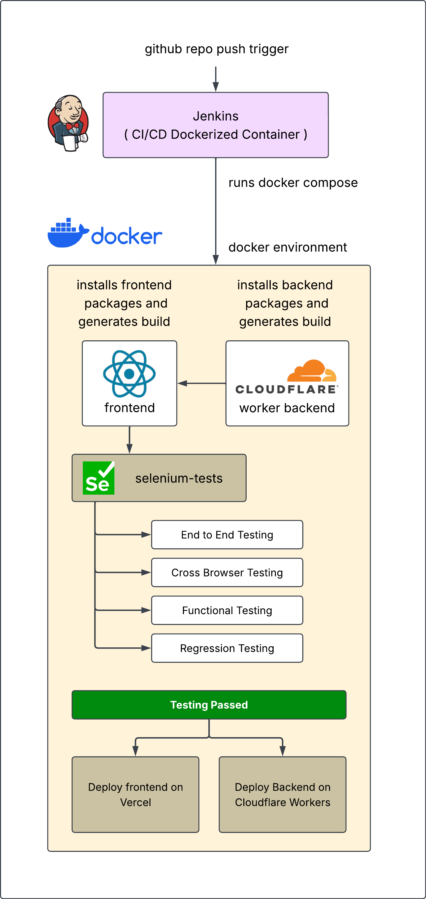
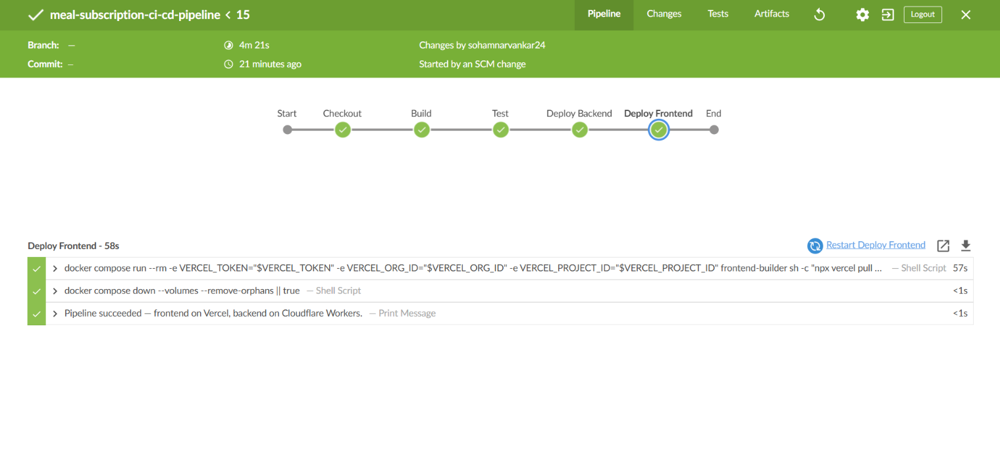

# Tandurust — Meal Subscription Platform
### *Automated CI/CD Pipeline & End-to-End Selenium Testing Engine*

[](http://localhost:8080)
[-success?logo=selenium&style=for-the-badge)](./selenium-tests)
[](https://ci-cd-automation-ochre.vercel.app)
[](https://jenkins-selenium-demo.sohamnarvankar24.workers.dev)

---

## About Project

**Tandurust** is a modern, full-stack meal subscription portal engineered for high performance, accessibility, and zero-downtime deployments. 

This repository houses the full application codebase alongside a **production-grade CI/CD pipeline** powered by **Jenkins**, **Docker Compose**, **Cloudflare Workers**, and **Vercel**. Every code push automatically triggers a 34-test headless Selenium suite in isolated containers before deploying production artifacts to global edge networks.

---

##  System Architecture & Data Flow

The platform separates execution into containerized testing environments during integration, and deploys to serverless edge platforms for production.



### Key Architecture Components:
* **Frontend Application (`/frontend`)**: Built with React, TypeScript, Vite, and CSS Modules. Deployed directly to **Vercel Edge Network**.
* **Backend API Service (`/backend`)**: Ultra-fast serverless API built with TypeScript and **Hono**, deployed to **Cloudflare Workers**.
* **Test Automation Suite (`/selenium-tests`)**: Python Pytest + Selenium WebDriver test engine running against containerized Chrome instances.
* **Pipeline Orchestrator**: **Jenkins CI/CD** executing multi-container builds via Docker Compose.

---

##  CI/CD Pipeline Overview

The pipeline guarantees that **broken code or regression bugs never reach production**. 



### Stage-by-Stage Breakdown:

| Stage | Action / Execution | Safeguard & Goal |
| :--- | :--- | :--- |
| **1. Checkout** | Pulls latest code from Git `master` branch. | Ensures clean workspace snapshot. |
| **2. Build** | Compiles Docker container images for `backend`, `frontend`, and `selenium` services via Docker Compose. | Validates compilation and bakes dependencies into containers. |
| **3. Test** | Spins up frontend and backend services in an isolated Docker network and executes all 34 Selenium PyTest cases. | `--exit-code-from selenium` enforces 100% test pass rate required to proceed. |
| **4. Deploy Backend** | Runs `wrangler deploy` inside a Node container using `CLOUDFLARE_API_TOKEN` & `CLOUDFLARE_ACCOUNT_ID`. | Deploys backend API to Cloudflare Workers edge network. |
| **5. Deploy Frontend** | Pulls settings and executes `vercel deploy --prod` via Vercel CLI. | Pushes production bundle to Vercel global CDN. |

---

##  Automated Selenium Test Suite (34/34 Passing)

The test suite covers full end-to-end user journeys, responsive viewports, functional operations, and edge-case handling.

```
=========================== Short Test Summary Info ============================
PASSED tests/cross-browser-testing/test_browser_compatibility.py::test_html5_form_input_types
PASSED tests/cross-browser-testing/test_browser_compatibility.py::test_aria_accessibility_landmarks
PASSED tests/cross-browser-testing/test_responsive_viewports.py::test_login_page_responsive_layout[Desktop 1080p-1920-1080]
PASSED tests/cross-browser-testing/test_responsive_viewports.py::test_login_page_responsive_layout[Laptop HD-1366-768]
PASSED tests/cross-browser-testing/test_responsive_viewports.py::test_login_page_responsive_layout[Tablet Portrait-768-1024]
PASSED tests/cross-browser-testing/test_responsive_viewports.py::test_login_page_responsive_layout[Mobile iPhone-375-667]
PASSED tests/cross-browser-testing/test_responsive_viewports.py::test_browse_plans_responsive_grid[Desktop 1080p-1920-1080]
PASSED tests/cross-browser-testing/test_responsive_viewports.py::test_browse_plans_responsive_grid[Laptop HD-1366-768]
PASSED tests/cross-browser-testing/test_responsive_viewports.py::test_browse_plans_responsive_grid[Tablet Portrait-768-1024]
PASSED tests/cross-browser-testing/test_responsive_viewports.py::test_browse_plans_responsive_grid[Mobile iPhone-375-667]
PASSED tests/end-to-end-testing/test_admin_journey_e2e.py::test_admin_route_redirection_and_portal_features
PASSED tests/end-to-end-testing/test_customer_journey_e2e.py::test_complete_customer_user_journey
PASSED tests/functional-testing/test_auth_functional.py::test_customer_login_success
PASSED tests/functional-testing/test_auth_functional.py::test_admin_login_success
PASSED tests/functional-testing/test_auth_functional.py::test_login_invalid_credentials
PASSED tests/functional-testing/test_auth_functional.py::test_customer_registration_success
PASSED tests/functional-testing/test_auth_functional.py::test_admin_registration_success
PASSED tests/functional-testing/test_auth_functional.py::test_logout_functionality
PASSED tests/functional-testing/test_meal_plans_functional.py::test_customer_browse_meal_plans
PASSED tests/functional-testing/test_meal_plans_functional.py::test_customer_subscribe_to_meal_plan
PASSED tests/functional-testing/test_meal_plans_functional.py::test_meal_plans_category_filtering
PASSED tests/functional-testing/test_subscriptions_functional.py::test_customer_view_subscriptions
PASSED tests/functional-testing/test_subscriptions_functional.py::test_customer_pause_and_resume_subscription
PASSED tests/functional-testing/test_subscriptions_functional.py::test_customer_cancel_subscription
PASSED tests/regression-testing/test_auth_regression.py::test_registration_short_password_validation
PASSED tests/regression-testing/test_auth_regression.py::test_registration_duplicate_email_validation
PASSED tests/regression-testing/test_auth_regression.py::test_unauthenticated_protected_route_redirection
PASSED tests/regression-testing/test_auth_regression.py::test_removed_admin_route_redirection
PASSED tests/regression-testing/test_auth_regression.py::test_empty_login_credentials_handling
PASSED tests/regression-testing/test_routes_and_edge_cases_regression.py::test_inactive_meal_plans_hidden_from_customers
PASSED tests/regression-testing/test_routes_and_edge_cases_regression.py::test_wildcard_route_redirection_for_customer
PASSED tests/regression-testing/test_routes_and_edge_cases_regression.py::test_wildcard_route_redirection_for_unauthenticated
PASSED tests/regression-testing/test_routes_and_edge_cases_regression.py::test_invalid_login_credentials_edge_case
PASSED tests/test_main.py::test_home_page_title
======================== 34 passed in 153s ========================
```

### Test Categories Covered:
1. **Cross-Browser & Compatibility**: Verifies HTML5 form element rendering and ARIA accessibility standards.
2. **Responsive Viewports**: Validates CSS grid & flex layout adaptivity across Desktop (1080p), Laptop (1366x768), Tablet (768x1024), and Mobile (375x667).
3. **End-to-End User Journeys**: Complete registration, food profile preference onboarding, meal plan selection, subscription status management (pause/resume/cancel).
4. **Functional & Security Validation**: Route guard redirection, protected path access, password strength enforcement, and duplicate registration protection.

---

## 🛠️ Local Setup & Quickstart

### Prerequisites
* [Docker Desktop](https://www.docker.com/products/docker-desktop/) (with Docker Compose v2)
* Node.js v20+ (optional, for direct local execution)

### 1. Clone & Spin Up Containers
```bash
git clone https://github.com/Sohamm24/meal-subscription-ci-cd.git
cd meal-subscription-ci-cd

# Spin up application services locally
docker compose up backend frontend
```
* Access Frontend: `http://localhost:80`
* Access Backend API: `http://localhost:8787`

### 2. Run Selenium Test Suite Locally
To run all 34 automated tests inside Docker:
```bash
docker compose up --abort-on-container-exit --exit-code-from selenium
```

---

##  Jenkins CI/CD Setup Guide

To run this pipeline in your local Jenkins instance:

1. **Mount Docker Socket into Jenkins Container**:
   ```bash
   docker run -d --name jenkins -p 8080:8080 -p 50000:50000 \
     -v //var/run/docker.sock:/var/run/docker.sock \
     jenkins/jenkins:lts
   ```
2. **Install Docker CLI inside Jenkins container**:
   ```bash
   docker exec -u 0 -it jenkins bash -c "apt-get update && apt-get install -y docker.io docker-compose-v2"
   ```
3. **Configure Jenkins Credentials** (**Manage Jenkins** $\rightarrow$ **Credentials**):
   * `CLOUDFLARE_API_TOKEN`: Secret text (Cloudflare API Token with Workers edit scope)
   * `CLOUDFLARE_ACCOUNT_ID`: Secret text (Cloudflare 32-character Account ID)
   * `VERCEL_TOKEN`: Secret text (Vercel Personal Access Token)
   * `VERCEL_ORG_ID`: Secret text (Vercel Organization ID)
   * `VERCEL_PROJECT_ID`: Secret text (Vercel Project ID)

---

## 🌐 Live Deployments

* **Frontend Application**: [https://ci-cd-automation-ochre.vercel.app](https://ci-cd-automation-ochre.vercel.app)
* **Cloudflare API Worker**: [https://jenkins-selenium-demo.sohamnarvankar24.workers.dev](https://jenkins-selenium-demo.sohamnarvankar24.workers.dev)

---
